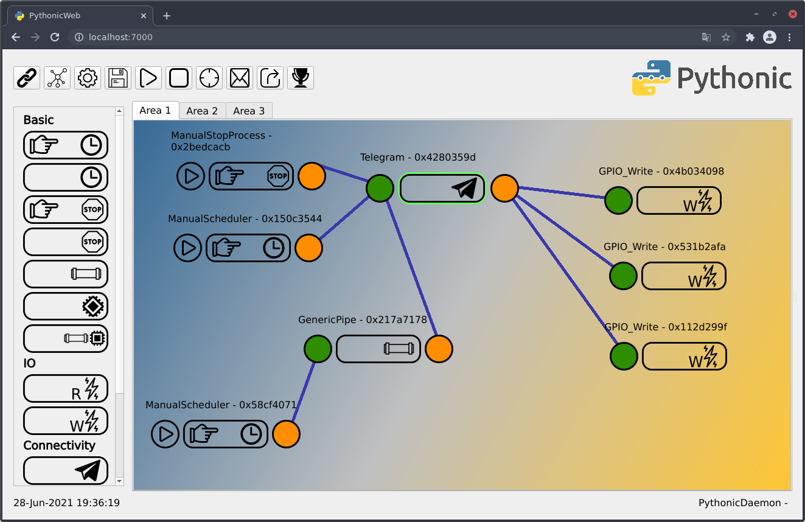

## Graphical Python programming for trading and automation

## Installation 

You can run Pythonic natively on any platform, as a container or on your Raspberry PI.

## Container based installation

Pythonic is available as container image which can be run by [Podman](https://podman.io/) or [Docker](https://www.docker.com/).

#### 1. Pull the image from the server

`podman pull pythonicautomation/pythonic`

`docker pull pythonicautomation/pythonic`

#### 2. Create a container

`podman run -d -p 7000:7000 -p 8000:8000 pythonic`

`docker run -d -p 7000:7000 -p 8000:8000 pythonicautomation/pythonic`

## Native Installation

#### 1. Install [Python 3.9](https://www.python.org/)

#### 2a. [Linux]

On Linux based systems,
run `sudo pip3 install Pythonic`
or `sudo python3 -m pip install Pythonic`

In general, root-rights are not required but when you run without it, the start script under
`/usr/local/bin/` won't get installed.

#### 2b. [Windows]

On Windows, open the command line or the Powershell and type:
`pip3 install Pythonic`

Make sure that the Python script folder (e.g. under Python 3.7: `%HOMEPATH%\AppData\Local\Programs\Python\Python37\Scripts`)
if part of the `Path` environemnt variable.

#### 3. Run Pythonic

Open a command shell and simply type `Pythonic`.

 
## Raspberry PI Image
  
The image is available at [sourceforge.net](https://sourceforge.net/projects/pythonicrpi/)

The credentials for login at Cockpit are:

- Username: **pythonic**
- Password: **guetersloh**

## Endpoints

Open your favorite WebAssembly compatible web browser and navigate to...

- [http://127.0.0.1:7000/](http://127.0.0.1:7000/) ... to open the GUI
- [http://127.0.0.1:7000/log](http://127.0.0.1:7000/log) ... to get an overview of available log files
- [http://127.0.0.1:7000/2021_03_15.txt](http://127.0.0.1:7000/2021_03_15.txt) ... to open the actual log file of 15. March 2021 (requested date must be available)
- [http://127.0.0.1:7000/generic_python_73594528.py](http://127.0.0.1:7000/generic_python_73594528.py) ... to download a specific *\*.py*-file
- [http://127.0.0.1:7000/current_config.json](http://127.0.0.1:7000/current_config.json) ... to download the grid configuration file
- [http://127.0.0.1:8000/](http://127.0.0.01:8000/) ... to open code server (VS Code in browser - **container and Raspberry Pi only**)
- [http://127.0.0.1:9090/](http://127.0.0.01:9090/) ... to open Cockpit system manager (**Raspberry Pi image only**)

## Editing elements

On Windows, when you drop an element to the working areay, the related *\*.py*-file gets copied
to `%HOMEPATH%\Pythonic\executables`. On Linux or Mac you can find them under `~/Pythonic/executables`.

## Donations
 
ADA (Cardano):
`addr1qxnm2s3ssdvxpjjwtlk8qy3j3q2e88te2garpnr3xng30hsglw2g08mvfnx3f7syetya0navr2qkyjlmlhfkzhx085equafjam`

XMR (Monero):
 `46EdjaZQ1og7oaSrPg7kNrdzCSpUhvtViSuMyVq16APaKTjizTGwe6FGg1vKqv4DS84CttqNsRVamKH9MP19cAfL7VagwWZ`

## [Become a Patron!](https://www.patreon.com/pythonicautomation?fan_landing=true)
